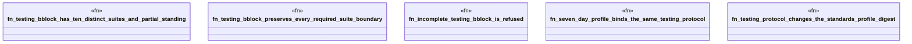

# `crates/ggen-architecture/tests/testing_bblock.rs`

Source SHA-256: `411b6fc4b3774ab4a834dbb2e07afa172449f2937c7e96e4dfd0a70305f0ebb5`

## Dependencies

- `ggen_architecture::{ seven_day_standards_profile, testing_bblock_protocol, TestingBblockStanding, TestingSuiteKind, TestingSuiteStatus, TESTING_BBLOCK_PROTOCOL_ID, }`

## Standing

- Structural parse: `ALIVE`
- Runtime behavior: `UNKNOWN`
