# `crates/ggen-cheat-scanner/src/lib.rs`

Source SHA-256: `6564022a14034cb8682b0b6f3bdf549ea3502195f9708074887b7b43d62bb66e`

```mermaid
classDiagram
    class struct_Finding {
      <<struct>>
      +"rule_id: &'static str"
      +"file: PathBuf"
      +"line: usize"
      +"message: String"
    }
    class struct_CheatRule {
      <<struct>>
      +"id: &'static str"
      +"title: &'static str"
      +"detection_contract: &'static str"
    }
    class fn_get_rules {
      <<fn>>
    }
    class fn_has_attr_named {
      <<fn>>
    }
    class fn_is_test_fn {
      <<fn>>
    }
    class fn_macro_name_of {
      <<fn>>
    }
    class fn_is_assert_true {
      <<fn>>
    }
    class struct_AssertionCollector {
      <<struct>>
      +"asserts: Vec~syn::Macro~"
      +"any_failure_capable: bool"
    }
    class fn_collect_assertions {
      <<fn>>
    }
    class struct_TautologyVisitor {
      <<struct>>
      +"file: &'a Path"
      +"findings: Vec~Finding~"
    }
    class fn_method_receiver_str {
      <<fn>>
    }
    class fn_line_of {
      <<fn>>
    }
    class fn_item_fn_line {
      <<fn>>
    }
    class fn_impl_item_fn_line {
      <<fn>>
    }
    class struct_ScanVisitor {
      <<struct>>
      +"file: &'a Path"
      +"findings: Vec~Finding~"
    }
    class fn_check_test_fn_body {
      <<fn>>
    }
    class fn_scan_automock {
      <<fn>>
    }
    class fn_scan_source {
      <<fn>>
    }
    class struct_ImplRecord {
      <<struct>>
      +"trait_name: String"
      +"type_name: String"
      +"file: PathBuf"
      +"line: usize"
    }
    class struct_ImplCollector {
      <<struct>>
      +"file: &'a Path"
      +"records: Vec~ImplRecord~"
    }
    class fn_type_name_of {
      <<fn>>
    }
    class fn_collect_impls {
      <<fn>>
    }
    class fn_is_mock_or_fake_name {
      <<fn>>
    }
    class fn_find_mock_substitutes {
      <<fn>>
    }
    class fn_should_skip {
      <<fn>>
    }
    note "Visit~"
    note "std::fmt::Display for Finding"
```

## Dependencies

- `std::collections::BTreeMap`
- `std::path::{Path, PathBuf}`
- `syn::spanned::Spanned`
- `syn::visit::{self, Visit}`
- `syn::{Expr, ImplItemFn, ItemFn, ItemImpl, ItemUse}`

## Standing

- Structural parse: `ALIVE`
- Runtime behavior: `UNKNOWN`
