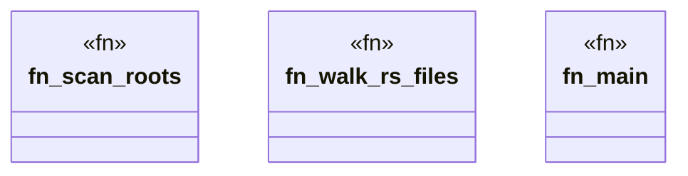

# `crates/ggen-cheat-scanner/src/main.rs`

Source SHA-256: `257508f073fe2b5b2bdefbc3a587220536e6074191a29267af5f29dafce85e08`

## Dependencies

- `ggen_cheat_scanner::{ collect_impls, find_mock_substitutes, get_rules, scan_source, should_skip, Finding, }`
- `std::fs`
- `std::path::{Path, PathBuf}`
- `std::process`
- `walkdir::WalkDir`

## Standing

- Structural parse: `ALIVE`
- Runtime behavior: `UNKNOWN`
