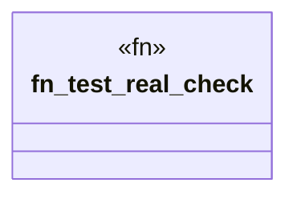

# `crates/ggen-cheat-scanner/tests/fixtures/t01_vacuous_clean.rs`

Source SHA-256: `5677141f04c70930893f3fbbeb5a50394a9b882170e3bb1f0b46660c21c35890`

## Dependencies

- None observed.

## Standing

- Structural parse: `ALIVE`
- Runtime behavior: `UNKNOWN`
