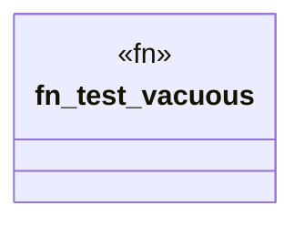

# `crates/ggen-cheat-scanner/tests/fixtures/t01_vacuous_positive.rs`

Source SHA-256: `b903e3564d5b383b7232638807988a0a199e4d295baa3b4244b37595b357fad4`

## Dependencies

- None observed.

## Standing

- Structural parse: `ALIVE`
- Runtime behavior: `UNKNOWN`
