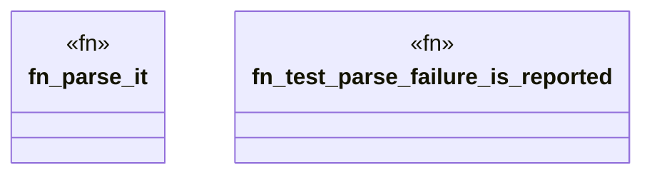

# `crates/ggen-cheat-scanner/tests/fixtures/t02_tautology_clean.rs`

Source SHA-256: `26441cbcfcd79d0d9a44eac2839263f1e3363d8a77173e43ef2b25a75961cd06`

## Dependencies

- None observed.

## Standing

- Structural parse: `ALIVE`
- Runtime behavior: `UNKNOWN`
