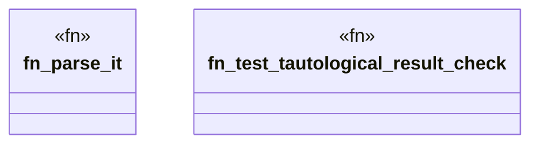

# `crates/ggen-cheat-scanner/tests/fixtures/t02_tautology_positive.rs`

Source SHA-256: `ed58ba0eb22ba70ec9706e63a48d769bc3a20bc39d7a9e301c9174a64ec6857c`

## Dependencies

- None observed.

## Standing

- Structural parse: `ALIVE`
- Runtime behavior: `UNKNOWN`
