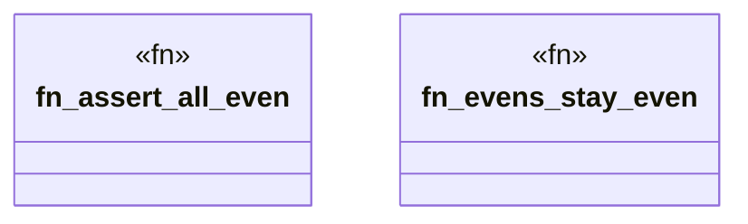

# `crates/ggen-cheat-scanner/tests/fixtures/t03_assert_helper_clean.rs`

Source SHA-256: `20bfd0d217ebcb71fd1579c9d2fbb090626e49d4440140c478e468fd8d6e75b6`

## Dependencies

- None observed.

## Standing

- Structural parse: `ALIVE`
- Runtime behavior: `UNKNOWN`
