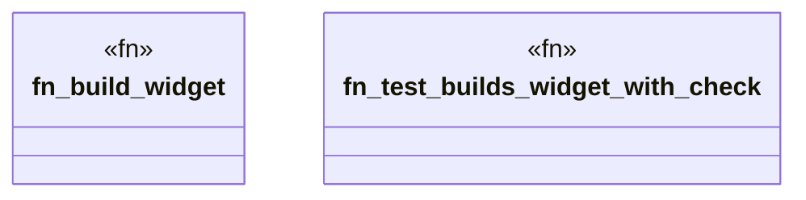

# `crates/ggen-cheat-scanner/tests/fixtures/t03_no_assertion_clean.rs`

Source SHA-256: `47c8ed2c562583c767ec60595440e2ceadb79b38c71d122f4b404f66532d16aa`

## Dependencies

- None observed.

## Standing

- Structural parse: `ALIVE`
- Runtime behavior: `UNKNOWN`
