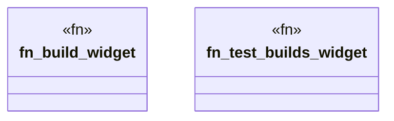

# `crates/ggen-cheat-scanner/tests/fixtures/t03_no_assertion_positive.rs`

Source SHA-256: `84c84eeb29dd73a603f56c2282e01a327e613a345705ac703d0189c0417f1bf9`

## Dependencies

- None observed.

## Standing

- Structural parse: `ALIVE`
- Runtime behavior: `UNKNOWN`
