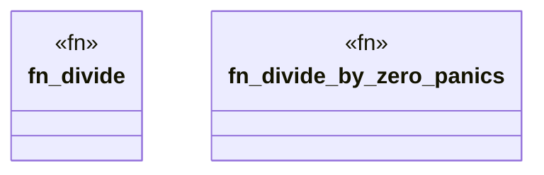

# `crates/ggen-cheat-scanner/tests/fixtures/t03_should_panic_clean.rs`

Source SHA-256: `24723d230e749d430bd5e43d2f215f1e88becc2a047c9fcd5f40e1eb261baf0c`

## Dependencies

- None observed.

## Standing

- Structural parse: `ALIVE`
- Runtime behavior: `UNKNOWN`
