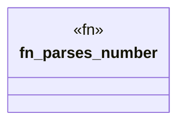

# `crates/ggen-cheat-scanner/tests/fixtures/t03_try_operator_clean.rs`

Source SHA-256: `f652f501fa28099dc344135db7afc5e084581a9683463a55ac344b1b4e737868`

## Dependencies

- `std::num::ParseIntError`

## Standing

- Structural parse: `ALIVE`
- Runtime behavior: `UNKNOWN`
