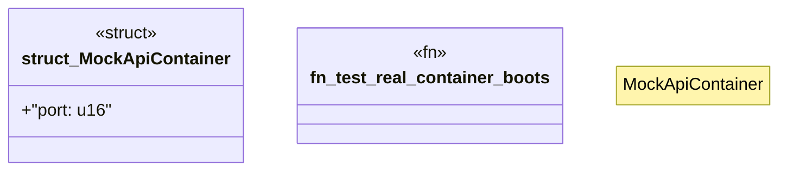

# `crates/ggen-cheat-scanner/tests/fixtures/t04_mock_import_clean.rs`

Source SHA-256: `410ae69aae7b0d9b4fe4f721a7c71631203575e2adca5e294a9746491d251075`

## Dependencies

- None observed.

## Standing

- Structural parse: `ALIVE`
- Runtime behavior: `UNKNOWN`
