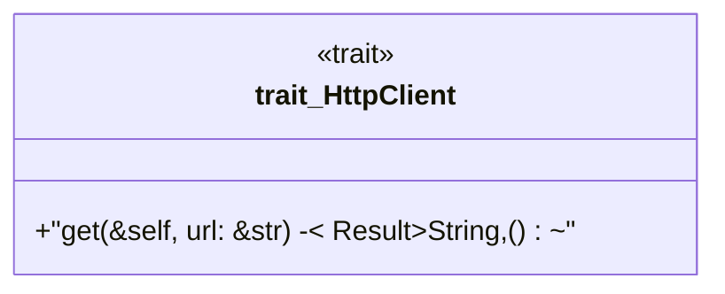

# `crates/ggen-cheat-scanner/tests/fixtures/t04_mock_import_positive.rs`

Source SHA-256: `f9b4c876fa8dfee5fb6adba490e906c2bd596aa7b761bd868318e23b01655128`

## Dependencies

- `mockall::mock`

## Standing

- Structural parse: `ALIVE`
- Runtime behavior: `UNKNOWN`
