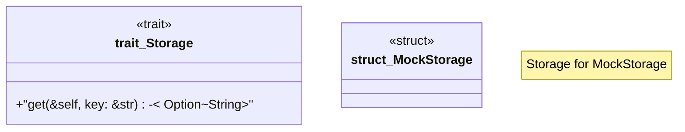

# `crates/ggen-cheat-scanner/tests/fixtures/t04_substitute_mock.rs`

Source SHA-256: `01a8d6f172f92d663fab805fc8fc4b76deca43a7e433888006275f3d2a46a403`

## Dependencies

- None observed.

## Standing

- Structural parse: `ALIVE`
- Runtime behavior: `UNKNOWN`
