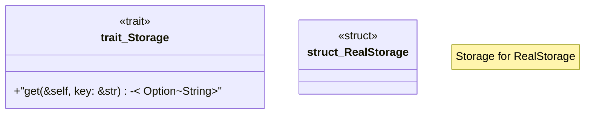

# `crates/ggen-cheat-scanner/tests/fixtures/t04_substitute_real.rs`

Source SHA-256: `d9ec518331c01135342275b8531848cb489cc815feb59aed01c53bc4b8193b0b`

## Dependencies

- None observed.

## Standing

- Structural parse: `ALIVE`
- Runtime behavior: `UNKNOWN`
