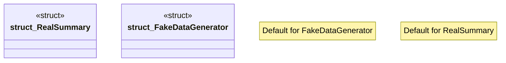

# `crates/ggen-cheat-scanner/tests/fixtures/t04_substitute_std_trait_clean.rs`

Source SHA-256: `3b950d3adfa5c6516452978caaaa6897910ce36b54565157b2760a31de062131`

## Dependencies

- None observed.

## Standing

- Structural parse: `ALIVE`
- Runtime behavior: `UNKNOWN`
