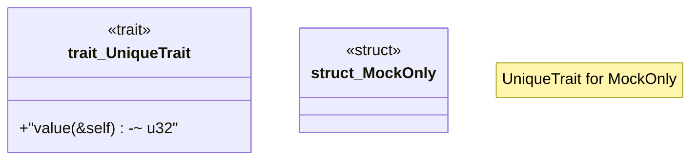

# `crates/ggen-cheat-scanner/tests/fixtures/t04_substitute_stub_clean.rs`

Source SHA-256: `f0dcc48379cd0407fa0b2ddf23331038bfd1cbac9cb734e489e75d20d950ee07`

## Dependencies

- None observed.

## Standing

- Structural parse: `ALIVE`
- Runtime behavior: `UNKNOWN`
