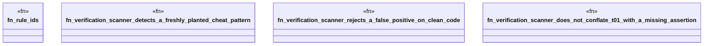

# `crates/ggen-cheat-scanner/tests/verification_subsystem_evidence_test.rs`

Source SHA-256: `081511d77b32668b180d6be25457e293611c4ecb9a5b7fbba14499a2d7e3c0b7`

## Dependencies

- `ggen_cheat_scanner::scan_source`
- `std::path::PathBuf`

## Standing

- Structural parse: `ALIVE`
- Runtime behavior: `UNKNOWN`
