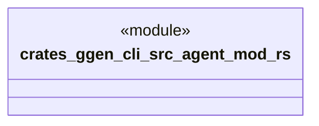

# `crates/ggen-cli/src/agent/mod.rs`

Source SHA-256: `e3eaf789b92c6abe2ed229ee8a9b37484a050073417937f2f1bf0969b8e054ee`

## Dependencies

- `ggen_marketplace::agent::*`

## Standing

- Structural parse: `ALIVE`
- Runtime behavior: `UNKNOWN`
