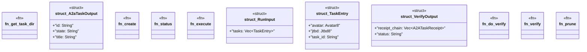

# `crates/ggen-cli/src/cmds/a2a.rs`

Source SHA-256: `d7f913798f6d2a7864fae55be3a2ff82b9479e5e71cb9b484aee5b6e51cab75d`

## Dependencies

- `clap_noun_verb::Result`
- `clap_noun_verb_macros::verb`
- `ggen_lsp::a2a_mcp::a2a::receipt::{ AlignmentEvidence, ExpectedPathEvidence, McpInvocationEvidence, ObservedPathEvidence, OcelEvent, OcelObject, OcelObjectRef, ReceiptOcelSlice, }`
- `ggen_lsp::a2a_mcp::a2a::{ A2ARefusalState, A2AState, A2ATaskReceipt, Avatar8, Jtbd8, Task, TaskState, }`
- `serde::{Deserialize, Serialize}`
- `std::fs`
- `std::path::PathBuf`

## Standing

- Structural parse: `ALIVE`
- Runtime behavior: `UNKNOWN`
