# `crates/ggen-cli/src/cmds/agent.rs`

Source SHA-256: `7962d8d81870ee2575c06e4e08252eeb64f0ab5fceebfa813558201ee2cc1325`

```mermaid
classDiagram
    class fn_agent {
      <<fn>>
    }
    class fn_agent_at {
      <<fn>>
    }
    class fn_lift {
      <<fn>>
    }
    class fn_json {
      <<fn>>
    }
    class fn_capabilities {
      <<fn>>
    }
    class fn_search {
      <<fn>>
    }
    class fn_list {
      <<fn>>
    }
    class fn_show {
      <<fn>>
    }
    class fn_resolve {
      <<fn>>
    }
    class fn_compatibility {
      <<fn>>
    }
    class fn_status {
      <<fn>>
    }
    class fn_verify {
      <<fn>>
    }
    class fn_install {
      <<fn>>
    }
    class fn_install_impl {
      <<fn>>
    }
    class fn_remove {
      <<fn>>
    }
```

## Dependencies

- `clap_noun_verb::{NounVerbError, Result}`
- `clap_noun_verb_macros::verb`
- `crate::agent::{InstallRequest, PackAgent}`

## Standing

- Structural parse: `ALIVE`
- Runtime behavior: `UNKNOWN`
