# `crates/ggen-cli/src/cmds/bblock.rs`

Source SHA-256: `f85bf865e8a62c2c7d8c7d2fa912f955d60fff774a886eb48d5d427d8b8b4aad`

```mermaid
classDiagram
    class struct_Catalog {
      <<struct>>
      +"schema: String"
      +"version: String"
      +"providers: Vec~Provider~"
      +"groups: Vec~BlockGroup~"
    }
    class struct_Provider {
      <<struct>>
      +"id: String"
      +"title: String"
      +"aliases: Vec~String~"
    }
    class struct_BlockGroup {
      <<struct>>
      +"id: String"
      +"title: String"
      +"description: String"
      +"directory: String"
      +"dependencies: Vec~String~"
      +"common_packs: Vec~String~"
      +"provider_packs: BTreeMap~String"
    }
    class struct_BlockPlan {
      <<struct>>
      +"schema: &'static str"
      +"catalog_version: String"
      +"catalog_digest: String"
      +"provider: String"
      +"requested_group: String"
      +"resolved_groups: Vec~String~"
      +"directories: Vec~String~"
      +"packs: Vec~String~"
      +"plan_digest: String"
    }
    class struct_ReceiptBody {
      <<struct>>
      +"schema: &'static str"
      +"operation: &'a str"
      +"provider: &'a str"
      +"group: &'a str"
      +"catalog_digest: &'a str"
      +"plan_digest: &'a str"
      +"previous_digest: &'a str"
      +"artifacts: &'a [String]"
    }
    class struct_Receipt {
      <<struct>>
      +"schema: String"
      +"operation: String"
      +"provider: String"
      +"group: String"
      +"catalog_digest: String"
      +"plan_digest: String"
      +"previous_digest: String"
      +"artifacts: Vec~String~"
      +"digest_algorithm: String"
      +"digest: String"
    }
    class fn_catalog {
      <<fn>>
    }
    class fn_catalog_digest {
      <<fn>>
    }
    class fn_validate_catalog {
      <<fn>>
    }
    class fn_validate_pack_id {
      <<fn>>
    }
    class fn_validate_relative_path {
      <<fn>>
    }
    class fn_normalize_provider {
      <<fn>>
    }
    class fn_find_group {
      <<fn>>
    }
    class fn_visit_group {
      <<fn>>
    }
    class fn_resolve {
      <<fn>>
    }
    class fn_digest {
      <<fn>>
    }
    class fn_project_root {
      <<fn>>
    }
    class fn_runtime_root {
      <<fn>>
    }
    class fn_write_json {
      <<fn>>
    }
    class fn_previous_receipt_digest {
      <<fn>>
    }
    class fn_plan_paths {
      <<fn>>
    }
    class fn_write_plan_receipts {
      <<fn>>
    }
    class fn_relative {
      <<fn>>
    }
    class fn_enable_plan {
      <<fn>>
    }
    class fn_providers {
      <<fn>>
    }
    class fn_list {
      <<fn>>
    }
    class fn_inspect {
      <<fn>>
    }
    class fn_group {
      <<fn>>
    }
    class fn_plan {
      <<fn>>
    }
    class fn_enable {
      <<fn>>
    }
    class fn_validate {
      <<fn>>
    }
    class mod_tests {
      <<mod>>
    }
    note "Receipt"
```

## Dependencies

- `clap_noun_verb::{NounVerbError, Result}`
- `clap_noun_verb_macros::verb`
- `ggen_marketplace::{ marketplace::models::PackageId, packs::lockfile::{LockedPack, PackLockfile, PackSource}, }`
- `serde::{Deserialize, Serialize}`
- `serde_json::{json, Value}`
- `std::{ collections::{BTreeMap, BTreeSet}, fs, path::{Component, Path, PathBuf}, }`
- `super::*`

## Standing

- Structural parse: `ALIVE`
- Runtime behavior: `UNKNOWN`
