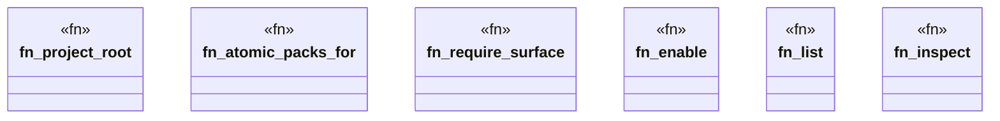

# `crates/ggen-cli/src/cmds/capability.rs`

Source SHA-256: `40d764940beffaab7abdee5d9ebaf5ba64a92a017cd5d7823414f4e88680f1f5`

## Dependencies

- `clap_noun_verb::{NounVerbError, Result}`
- `clap_noun_verb_macros::verb`
- `ggen_marketplace::packs::lockfile::{LockedPack, PackLockfile, PackSource}`
- `ggen_marketplace::packs_registry::capability_registry::{ list_capabilities, resolve_capability_to_packs, }`
- `serde_json::{json, Value}`
- `std::path::PathBuf`

## Standing

- Structural parse: `ALIVE`
- Runtime behavior: `UNKNOWN`
