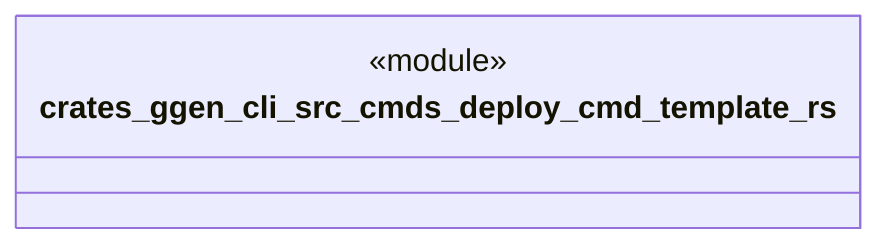

# `crates/ggen-cli/src/cmds/deploy_cmd_template.rs`

Source SHA-256: `f53196ed4099e28551c8a8293d24a12e32ccab8215eab34a901f1a5e6ffb557f`

## Dependencies

- None observed.

## Standing

- Structural parse: `ALIVE`
- Runtime behavior: `UNKNOWN`
