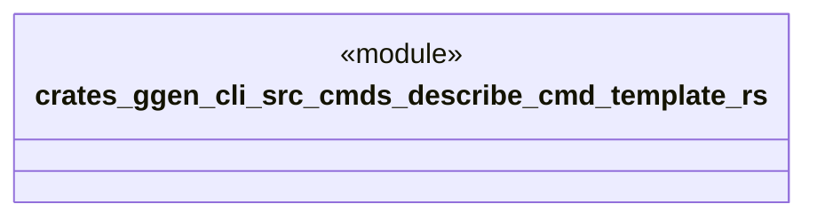

# `crates/ggen-cli/src/cmds/describe_cmd_template.rs`

Source SHA-256: `0ee767218e6b11ce192911810caa7f8496068d5c370f6dfaa56f549e578b298e`

## Dependencies

- None observed.

## Standing

- Structural parse: `ALIVE`
- Runtime behavior: `UNKNOWN`
