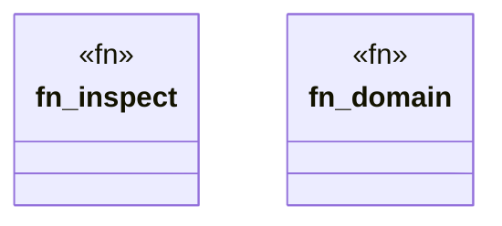

# `crates/ggen-cli/src/cmds/doctor.rs`

Source SHA-256: `d836e898e5de0ac9b8270c5e4847011885da42e71530a62777ccfa920ee2c2ac`

## Dependencies

- `clap_noun_verb::Result`
- `clap_noun_verb_macros::verb`
- `serde_json::Value`
- `std::path::Path`
- `super::maximalism`

## Standing

- Structural parse: `ALIVE`
- Runtime behavior: `UNKNOWN`
