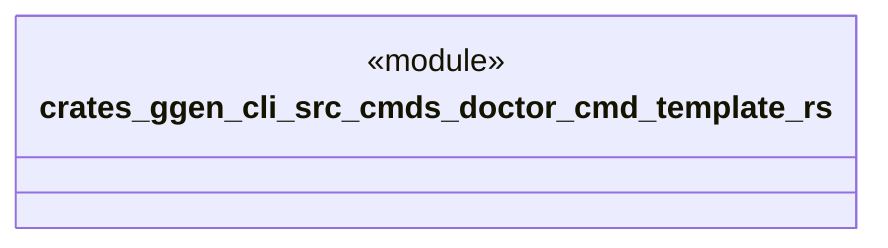

# `crates/ggen-cli/src/cmds/doctor_cmd_template.rs`

Source SHA-256: `69ced7a224a6c85b159611b9a88e93785c330e965e592e7fd3fa212c32132198`

## Dependencies

- None observed.

## Standing

- Structural parse: `ALIVE`
- Runtime behavior: `UNKNOWN`
