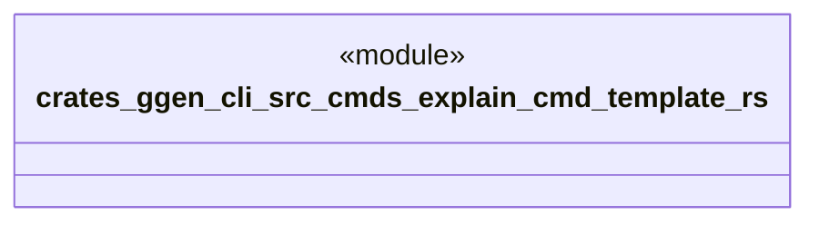

# `crates/ggen-cli/src/cmds/explain_cmd_template.rs`

Source SHA-256: `927bc7de3b0cb62ea1ca05398ebb200e134a9cc0e6d1fb243db4ace1b07a7355`

## Dependencies

- None observed.

## Standing

- Structural parse: `ALIVE`
- Runtime behavior: `UNKNOWN`
