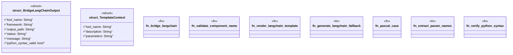

# `crates/ggen-cli/src/cmds/framework.rs`

Source SHA-256: `8103726109e0a2a18feed495aac096c80cf8f3bd2b85cdf806415926c423c85d`

## Dependencies

- `clap_noun_verb::Result as NounVerbResult`
- `clap_noun_verb_macros::verb`
- `serde::Serialize`
- `std::fs`
- `std::path::{Path, PathBuf}`
- `std::process::Command`
- `tera::Tera`

## Standing

- Structural parse: `ALIVE`
- Runtime behavior: `UNKNOWN`
