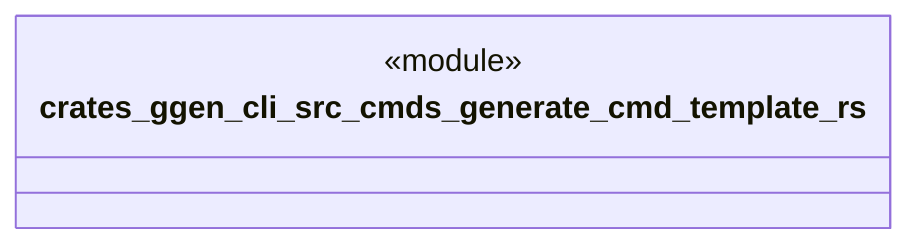

# `crates/ggen-cli/src/cmds/generate_cmd_template.rs`

Source SHA-256: `585617199f4d576003fd3760873f5747e32ac8a9bee0ba43e51f97e11ac9092f`

## Dependencies

- None observed.

## Standing

- Structural parse: `ALIVE`
- Runtime behavior: `UNKNOWN`
