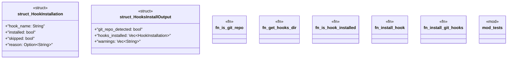

# `crates/ggen-cli/src/cmds/git_hooks.rs`

Source SHA-256: `890badabad336850ce5662bc00e489e0c32e852d8f003b78f1f084660d2e99ef`

## Dependencies

- `std::fs`
- `std::os::unix::fs::PermissionsExt`
- `std::path::{Path, PathBuf}`
- `super::*`
- `tempfile::TempDir`

## Standing

- Structural parse: `ALIVE`
- Runtime behavior: `UNKNOWN`
