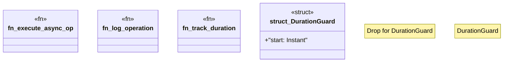

# `crates/ggen-cli/src/cmds/helpers.rs`

Source SHA-256: `cf2dd87592ef40476305a52961a310a95c3a449db469bc1a7d90e3b727e9989c`

## Dependencies

- `clap_noun_verb::Result`
- `log::debug`
- `serde_json::Value`
- `std::future::Future`
- `std::time::{Duration, Instant}`

## Standing

- Structural parse: `ALIVE`
- Runtime behavior: `UNKNOWN`
