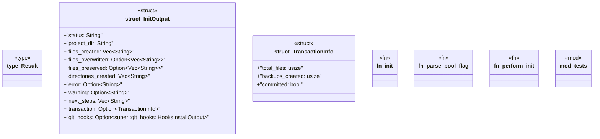

# `crates/ggen-cli/src/cmds/init.rs`

Source SHA-256: `9d07adec3575802e3956f8fcd81991d5a86b75bd183869ebe179f767def727bc`

## Dependencies

- `clap_noun_verb::Result as VerbResult`
- `clap_noun_verb_macros::verb`
- `crate::error::GgenError`
- `crate::scaffolding::preflight::PreFlightValidator`
- `crate::scaffolding::transaction::FileTransaction`
- `serde::Serialize`
- `std::fs`
- `std::os::unix::fs::PermissionsExt`
- `std::path::Path`
- `std::path::PathBuf`
- `super::*`
- `tempfile::tempdir`

## Standing

- Structural parse: `ALIVE`
- Runtime behavior: `UNKNOWN`
