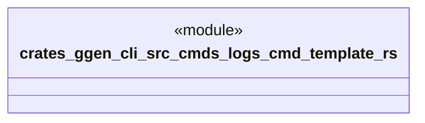

# `crates/ggen-cli/src/cmds/logs_cmd_template.rs`

Source SHA-256: `98169cb61b9f17e19ba40342c67f3ef2787d7290fa7ce9294f69b9a7955b91fc`

## Dependencies

- None observed.

## Standing

- Structural parse: `ALIVE`
- Runtime behavior: `UNKNOWN`
