# `crates/ggen-cli/src/cmds/lsp.rs`

Source SHA-256: `8eed65f1ea33a5ac232642992d378da765691990d7a05ff941fa08d00b69c59b`

```mermaid
classDiagram
    class struct_StartOutput {
      <<struct>>
      +"status: String"
      +"transport: String"
    }
    class struct_CheckSummary {
      <<struct>>
      +"error_count: usize"
      +"warning_count: usize"
    }
    class struct_EmitPackOutput {
      <<struct>>
      +"out_dir: String"
      +"agents: Vec~String~"
      +"files_written: usize"
      +"pack_hash: String"
      +"receipt_sig: Option~String~"
      +"bound_to_scan: bool"
    }
    class struct_MineSummary {
      <<struct>>
      +"events_analyzed: usize"
      +"failure_edges: usize"
      +"total_edges: usize"
      +"report_path: String"
      +"promoted_count: usize"
      +"promoted_path: String"
    }
    class struct_InitOutput {
      <<struct>>
      +"files_written: Vec~String~"
      +"pack_dir: String"
    }
    class fn_start {
      <<fn>>
    }
    class fn_serve {
      <<fn>>
    }
    class fn_check {
      <<fn>>
    }
    class fn_run_check {
      <<fn>>
    }
    class fn_init {
      <<fn>>
    }
    class fn_split_list {
      <<fn>>
    }
    class fn_replay {
      <<fn>>
    }
    class fn_metrics {
      <<fn>>
    }
    class fn_field_status {
      <<fn>>
    }
    class fn_mine {
      <<fn>>
    }
    class fn_parse_paths {
      <<fn>>
    }
    class fn_emit_pack {
      <<fn>>
    }
    class fn_read_scan_aggregate_hash {
      <<fn>>
    }
    class fn_verify_pack {
      <<fn>>
    }
```

## Dependencies

- `clap_noun_verb::Result`
- `clap_noun_verb_macros::verb`
- `serde::Serialize`
- `std::path::{Path, PathBuf}`

## Standing

- Structural parse: `ALIVE`
- Runtime behavior: `UNKNOWN`
