# `crates/ggen-cli/src/cmds/maximalism/evaluation.rs`

Source SHA-256: `2e2a60eb0fbb8b963ef131b2e2d5f5b7e95f899b5771ca9393f3b1d68880604c`

```mermaid
classDiagram
    class struct_Candidate {
      <<struct>>
      +"report: CapabilityReport"
      +"intrinsic_alive: bool"
      +"observed_any: bool"
      +"dependencies: Vec~String~"
    }
    class fn_expected_digest {
      <<fn>>
    }
    class fn_is_hex_digest {
      <<fn>>
    }
    class fn_safe_locator {
      <<fn>>
    }
    class fn_evidence_path {
      <<fn>>
    }
    class fn_evidence_bytes {
      <<fn>>
    }
    class fn_parse_evidence {
      <<fn>>
    }
    class fn_unique_nonempty {
      <<fn>>
    }
    class fn_exact_evidence_keys {
      <<fn>>
    }
    class fn_multiplier {
      <<fn>>
    }
    class fn_load {
      <<fn>>
    }
    class fn_validate_authority {
      <<fn>>
    }
    class fn_validate_sbb_receipt {
      <<fn>>
    }
    class fn_validate_sbb {
      <<fn>>
    }
    class fn_validate_proof {
      <<fn>>
    }
    class fn_validate_verifier {
      <<fn>>
    }
    class fn_passport_complete {
      <<fn>>
    }
    class fn_validate_passport {
      <<fn>>
    }
    class fn_validate_external_acceptance {
      <<fn>>
    }
    class fn_validate_execution_grant {
      <<fn>>
    }
    class fn_evaluate_capability {
      <<fn>>
    }
    class fn_cycle_nodes {
      <<fn>>
    }
    class fn_domain_space {
      <<fn>>
    }
    class fn_evaluate {
      <<fn>>
    }
    class fn_as_value {
      <<fn>>
    }
    class fn_validation {
      <<fn>>
    }
    class fn_combinations {
      <<fn>>
    }
    class fn_outcome_report {
      <<fn>>
    }
    class fn_domain_lens {
      <<fn>>
    }
    class fn_remediation {
      <<fn>>
    }
    class fn_doctor {
      <<fn>>
    }
    class fn_dependency_order {
      <<fn>>
    }
    class fn_wizard {
      <<fn>>
    }
    class fn_telco_id {
      <<fn>>
    }
    class fn_telco {
      <<fn>>
    }
```

## Dependencies

- `super::*`

## Standing

- Structural parse: `ALIVE`
- Runtime behavior: `UNKNOWN`
