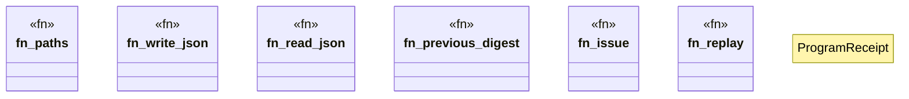

# `crates/ggen-cli/src/cmds/maximalism/receipts.rs`

Source SHA-256: `fb7bfda08e036551125e34ab0ef9bf85da5fd077d0ddfb02ea3be9d9cbdee084`

## Dependencies

- `super::*`

## Standing

- Structural parse: `ALIVE`
- Runtime behavior: `UNKNOWN`
