# `crates/ggen-cli/src/cmds/maximalism/tests.rs`

Source SHA-256: `57ce39d095f36eaf037921cd325260bbeab057e7407caeb1a3195ae49ab9ff75`

```mermaid
classDiagram
    class fn_write {
      <<fn>>
    }
    class fn_json_evidence {
      <<fn>>
    }
    class fn_sbb_receipt {
      <<fn>>
    }
    class fn_capability_id {
      <<fn>>
    }
    class fn_capability {
      <<fn>>
    }
    class fn_fixture {
      <<fn>>
    }
    class fn_read_manifest {
      <<fn>>
    }
    class fn_write_manifest {
      <<fn>>
    }
    class fn_rewrite_evidence {
      <<fn>>
    }
    class fn_complete_program_closes_domains_outcomes_and_thousand_x {
      <<fn>>
    }
    class fn_incomplete_passport_is_refused {
      <<fn>>
    }
    class fn_wrong_witness_kind_is_refused {
      <<fn>>
    }
    class fn_dependency_cycle_is_refused {
      <<fn>>
    }
    class fn_doctor_and_healthcare_actuation_are_refused {
      <<fn>>
    }
    class fn_receipts_replay_and_refuse_tampering {
      <<fn>>
    }
    class fn_wizard_is_topological_and_non_actuating {
      <<fn>>
    }
    class fn_telco_covers_office_register_line_bridge_and_record {
      <<fn>>
    }
```

## Dependencies

- `super::*`
- `super::evaluation::evaluate`

## Standing

- Structural parse: `ALIVE`
- Runtime behavior: `UNKNOWN`
