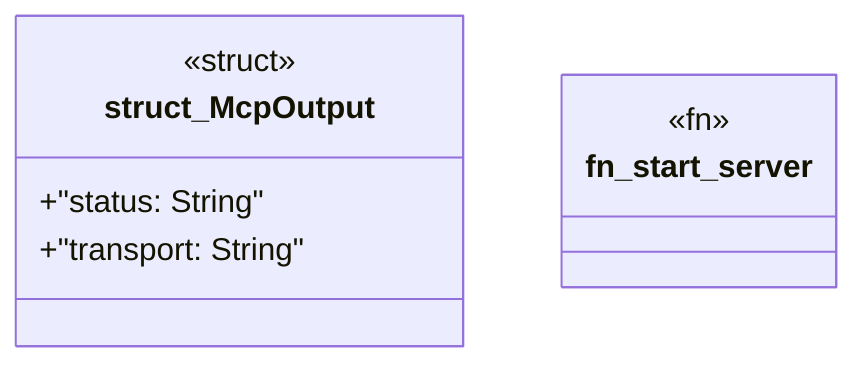

# `crates/ggen-cli/src/cmds/mcp.rs`

Source SHA-256: `3e4e7a48365fef7bd57f0ec135c53379b048b6ca3effef0512a53f0ceb89ccb5`

## Dependencies

- `clap_noun_verb::Result`
- `clap_noun_verb_macros::verb`
- `ggen_lsp::a2a_mcp::mcp_server::GgenMcpServer`
- `serde::Serialize`

## Standing

- Structural parse: `ALIVE`
- Runtime behavior: `UNKNOWN`
