# `crates/ggen-cli/src/cmds/ontology.rs`

Source SHA-256: `1237259bd74db43f02cb69cab13e79bb963c1b2d68bbe353255e9accbda8c849`

```mermaid
classDiagram
    class struct_OntologyListOutput {
      <<struct>>
      +"ontologies: Vec~OntologyListEntry~"
      +"count: usize"
    }
    class struct_OntologyListEntry {
      <<struct>>
      +"name: String"
      +"namespace: String"
      +"size: usize"
    }
    class struct_OntologyStatusOutput {
      <<struct>>
      +"uri: String"
      +"embedded: bool"
      +"location: String"
      +"size: Option~usize~"
      +"name: Option~String~"
    }
    class struct_OntologyInfoOutput {
      <<struct>>
      +"name: String"
      +"namespace: String"
      +"size: usize"
      +"embedded: bool"
      +"hash: Option~String~"
      +"metadata: BTreeMap~String"
    }
    class struct_OntologySearchOutput {
      <<struct>>
      +"query: String"
      +"results: Vec~OntologySearchResult~"
      +"count: usize"
      +"message: Option~String~"
    }
    class struct_OntologySearchResult {
      <<struct>>
      +"name: String"
      +"description: String"
      +"domain: String"
    }
    class struct_OntologyInstallOutput {
      <<struct>>
      +"package: String"
      +"success: bool"
      +"message: String"
      +"size_bytes: Option~u64~"
      +"digest: Option~String~"
      +"dependencies_count: usize"
    }
    class struct_OntologyLockOutput {
      <<struct>>
      +"lock_file: String"
      +"packages_count: usize"
      +"total_size_bytes: u64"
      +"message: String"
      +"packages: Vec~LockFileEntry~"
    }
    class struct_LockFileEntry {
      <<struct>>
      +"id: String"
      +"version: String"
      +"digest: String"
      +"installed_at: String"
    }
    class struct_NamespacesListOutput {
      <<struct>>
      +"namespaces: Vec~NamespaceEntry~"
      +"count: usize"
    }
    class struct_NamespaceEntry {
      <<struct>>
      +"prefix: String"
      +"uri: String"
      +"source: String"
    }
    class fn_list {
      <<fn>>
    }
    class fn_namespaces {
      <<fn>>
    }
    class fn_status {
      <<fn>>
    }
    class fn_info {
      <<fn>>
    }
    class fn_search {
      <<fn>>
    }
    class fn_install {
      <<fn>>
    }
    class fn_lock {
      <<fn>>
    }
    class mod_tests {
      <<mod>>
    }
```

## Dependencies

- `clap_noun_verb::Result as VerbResult`
- `clap_noun_verb_macros::verb`
- `ggen_marketplace::ontology_core::{CoreOntologyBundle, OntologyLoader}`
- `serde::Serialize`
- `std::collections::BTreeMap`
- `std::str::FromStr`
- `super::*`

## Standing

- Structural parse: `ALIVE`
- Runtime behavior: `UNKNOWN`
