# `crates/ggen-cli/src/cmds/pack.rs`

Source SHA-256: `2ba00f169dc1897ee25c84f874932edf4badc06427aea1bff754261631ac886b`

```mermaid
classDiagram
    class struct_AddOutput {
      <<struct>>
      +"pack_id: String"
      +"pack_name: String"
      +"status: String"
      +"message: String"
    }
    class struct_RemoveOutput {
      <<struct>>
      +"pack_name: String"
      +"status: String"
      +"message: String"
    }
    class struct_ListOutput {
      <<struct>>
      +"packs: Vec~PackSummary~"
      +"total: usize"
    }
    class struct_PackSummary {
      <<struct>>
      +"id: String"
      +"name: String"
      +"description: String"
      +"version: String"
      +"category: String"
      +"package_count: usize"
      +"template_count: usize"
      +"production_ready: bool"
      +"registry_type: String"
    }
    class struct_ShowOutput {
      <<struct>>
      +"id: String"
      +"name: String"
      +"description: String"
      +"version: String"
      +"category: String"
      +"package_count: usize"
      +"packages: Vec~String~"
      +"dependencies: Vec~String~"
      +"registry_type: String"
    }
    class struct_SearchOutput {
      <<struct>>
      +"query: String"
      +"results: Vec~SearchResult~"
      +"total: usize"
    }
    class struct_SearchResult {
      <<struct>>
      +"pack_id: String"
      +"name: String"
      +"description: String"
      +"score: f64"
      +"registry_type: String"
    }
    class struct_InstallOutput {
      <<struct>>
      +"pack_id: String"
      +"pack_name: String"
      +"status: String"
      +"message: String"
    }
    class fn_add {
      <<fn>>
    }
    class fn_remove {
      <<fn>>
    }
    class fn_list {
      <<fn>>
    }
    class fn_show {
      <<fn>>
    }
    class fn_search {
      <<fn>>
    }
    class fn_doctor {
      <<fn>>
    }
    class fn_pack_doctor_report {
      <<fn>>
    }
    class fn_cache_dir_check {
      <<fn>>
    }
    class fn_lockfile_check {
      <<fn>>
    }
    class fn_resolve_lockfile_path {
      <<fn>>
    }
    class fn_perform_search {
      <<fn>>
    }
    class fn_calculate_relevance {
      <<fn>>
    }
    class fn_validate_pack_name {
      <<fn>>
    }
    class fn_resolve_cache_dir {
      <<fn>>
    }
```

## Dependencies

- `clap_noun_verb::{NounVerbError, Result}`
- `clap_noun_verb_macros::verb`
- `ggen_marketplace::marketplace::install::{install_pack_by_id, InstallByIdInput}`
- `ggen_marketplace::packs::lockfile::PackLockfile`
- `ggen_marketplace::packs_registry::metadata::{list_packs, load_pack_metadata, show_pack}`
- `serde::Serialize`
- `std::path::PathBuf`

## Standing

- Structural parse: `ALIVE`
- Runtime behavior: `UNKNOWN`
