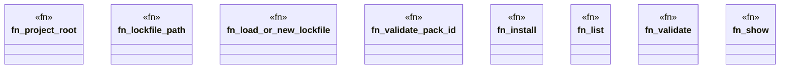

# `crates/ggen-cli/src/cmds/packs.rs`

Source SHA-256: `04679b8cb2fdbecd8b201b8816ef6682db6b47f55ba4625adaf173438b48fed4`

## Dependencies

- `clap_noun_verb::{NounVerbError, Result}`
- `clap_noun_verb_macros::verb`
- `crate::agent::{emit_install_receipt, PackInstallClosure}`
- `ggen_marketplace::packs::lockfile::{LockedPack, PackLockfile, PackSource}`
- `ggen_marketplace::packs_registry::metadata::show_pack`
- `ggen_marketplace::packs_registry::validate::validate_pack`
- `serde_json::{json, Value}`
- `std::path::{Path, PathBuf}`

## Standing

- Structural parse: `ALIVE`
- Runtime behavior: `UNKNOWN`
