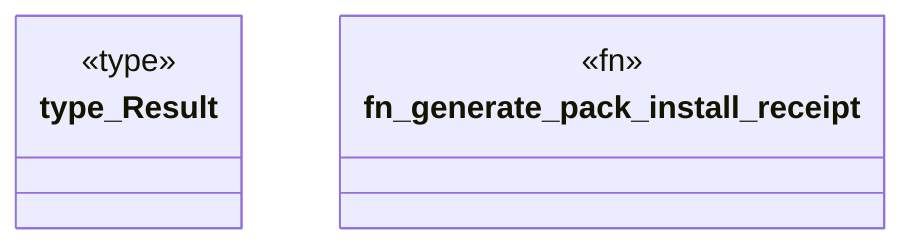

# `crates/ggen-cli/src/cmds/packs_receipt.rs`

Source SHA-256: `89d8a16eec56694a065b9fe5109dc4686653d0182e118ca266f9bf485754da68`

## Dependencies

- `crate::agent::{PackInstallClosure, PackReceiptError}`
- `std::path::PathBuf`

## Standing

- Structural parse: `ALIVE`
- Runtime behavior: `UNKNOWN`
