# `crates/ggen-cli/src/cmds/policy.rs`

Source SHA-256: `10dad617d5926b2c064b19c812a8ffd5dec407bf51f26984e8e12d7fe0f14061`

```mermaid
classDiagram
    class struct_ListOutput {
      <<struct>>
      +"profiles: Vec~ProfileSummary~"
      +"total: usize"
    }
    class struct_ProfileSummary {
      <<struct>>
      +"id: String"
      +"name: String"
      +"description: String"
      +"policy_count: usize"
      +"trust_requirement: String"
      +"receipt_requirement: String"
    }
    class struct_ValidateOutput {
      <<struct>>
      +"profile_id: String"
      +"passed: bool"
      +"violation_count: usize"
      +"policies_checked: usize"
      +"violations: Vec~ViolationSummary~"
    }
    class struct_ViolationSummary {
      <<struct>>
      +"policy_id: String"
      +"pack_id: String"
      +"description: String"
    }
    class struct_ShowOutput {
      <<struct>>
      +"profile_id: String"
      +"name: String"
      +"description: String"
      +"policies: Vec~PolicySummary~"
      +"trust_requirement: String"
      +"receipt_requirement: String"
      +"runtime_constraints: Vec~RuntimeConstraintSummary~"
    }
    class struct_PolicySummary {
      <<struct>>
      +"id: String"
      +"name: String"
      +"description: String"
      +"rule_count: usize"
    }
    class struct_RuntimeConstraintSummary {
      <<struct>>
      +"allowed_runtimes: Vec~String~"
      +"forbid_defaults: bool"
      +"require_explicit: bool"
    }
    class struct_LoadedPackContexts {
      <<struct>>
      +"contexts: Vec~PackContext~"
      +"malformed: Vec~(String"
    }
    class fn_load_pack_contexts_from_project {
      <<fn>>
    }
    class fn_load_pack_config_from_cache {
      <<fn>>
    }
    class fn_list {
      <<fn>>
    }
    class fn_run_policy_enforcement {
      <<fn>>
    }
    class fn_validate {
      <<fn>>
    }
    class fn_show {
      <<fn>>
    }
    class fn_check {
      <<fn>>
    }
```

## Dependencies

- `clap_noun_verb::Result as VerbResult`
- `clap_noun_verb_macros::verb`
- `ggen_marketplace::marketplace::metadata::{get_pack_cache_dir, load_pack_metadata}`
- `ggen_marketplace::marketplace::models::PackageId`
- `ggen_marketplace::marketplace::policy::{PackContext, PolicyReport}`
- `ggen_marketplace::marketplace::profile::{predefined_profiles, Profile, ProfileId}`
- `ggen_marketplace::packs::lockfile::PackLockfile`
- `serde::Serialize`
- `std::fs`
- `std::path::Path`

## Standing

- Structural parse: `ALIVE`
- Runtime behavior: `UNKNOWN`
