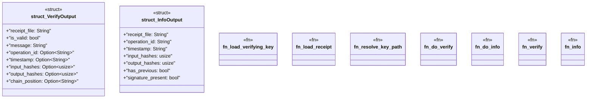

# `crates/ggen-cli/src/cmds/receipt.rs`

Source SHA-256: `a3759e3d199181132deeff8abd4974af4a02906a0fe497d417effe01adb66e0f`

## Dependencies

- `clap_noun_verb::{NounVerbError, Result}`
- `clap_noun_verb_macros::verb`
- `ed25519_dalek::VerifyingKey`
- `ggen_config::receipt::Receipt`
- `serde::Serialize`
- `std::{fs, path::PathBuf}`

## Standing

- Structural parse: `ALIVE`
- Runtime behavior: `UNKNOWN`
