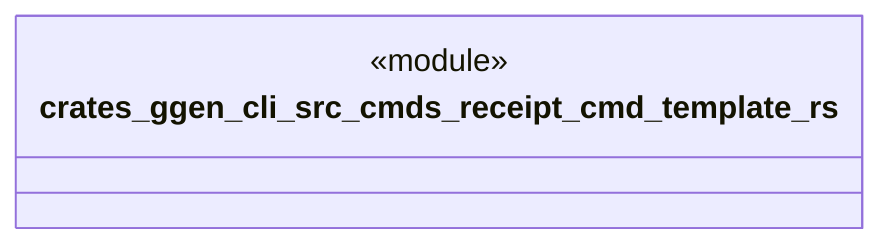

# `crates/ggen-cli/src/cmds/receipt_cmd_template.rs`

Source SHA-256: `ea22279556d9a9bfd5b65cf892c627d31dd29fd40bf5bf9fad930ced1a661628`

## Dependencies

- None observed.

## Standing

- Structural parse: `ALIVE`
- Runtime behavior: `UNKNOWN`
