# `crates/ggen-cli/src/cmds/sbb/evaluation.rs`

Source SHA-256: `24837524d3bcbdc867828d2ddab0ba6e36a90820bb7c17e594c804c2a6c234f9`

```mermaid
classDiagram
    class fn_expected_digest {
      <<fn>>
    }
    class fn_repository_root {
      <<fn>>
    }
    class fn_git {
      <<fn>>
    }
    class fn_repository_observed {
      <<fn>>
    }
    class fn_resolve_commit {
      <<fn>>
    }
    class fn_safe_locator {
      <<fn>>
    }
    class fn_evidence_observed {
      <<fn>>
    }
    class fn_unique_nonempty {
      <<fn>>
    }
    class fn_exact_keys {
      <<fn>>
    }
    class fn_evaluate_delta {
      <<fn>>
    }
    class fn_load {
      <<fn>>
    }
    class fn_evaluate {
      <<fn>>
    }
```

## Dependencies

- `super::*`

## Standing

- Structural parse: `ALIVE`
- Runtime behavior: `UNKNOWN`
