# `crates/ggen-cli/src/cmds/sbb/mod.rs`

Source SHA-256: `6c29c34b8af724a6ba4d57a015801d57ae775d313e06e8b7a36e692561610292`

```mermaid
classDiagram
    class mod_evaluation {
      <<mod>>
    }
    class mod_receipts {
      <<mod>>
    }
    class mod_tests {
      <<mod>>
    }
    class struct_Manifest {
      <<struct>>
      +"schema: String"
      +"sbb: Sbb"
      +"repository: Repository"
      +"distribution: BTreeMap~String"
      +"deltas: Vec~Delta~"
    }
    class struct_Sbb {
      <<struct>>
      +"id: String"
      +"version: String"
      +"architecture_contract: String"
      +"minimum_commit_equivalent_units: u64"
    }
    class struct_Repository {
      <<struct>>
      +"root: String"
    }
    class struct_Delta {
      <<struct>>
      +"id: String"
      +"commit: String"
      +"capability_iri: String"
      +"family: String"
      +"summary: String"
      +"ontology_modules: Vec~String~"
      +"textual_forms: Vec~String~"
      +"chain: BTreeMap~String"
      +"positive_witness: Evidence"
      +"negative_fixture: Evidence"
      +"adversarial_falsifier: Evidence"
      +"verifier: Evidence"
    }
    class struct_Evidence {
      <<struct>>
      +"locator: String"
      +"digest: String"
    }
    class struct_DeltaReport {
      <<struct>>
      +"id: String"
      +"commit: String"
      +"observed: bool"
      +"violations: Vec~String~"
    }
    class struct_Report {
      <<struct>>
      +"schema: String"
      +"manifest_digest: String"
      +"sbb: Sbb"
      +"standing: String"
      +"claim_ceiling: String"
      +"target_met: bool"
      +"eligible_for_external_admission: bool"
      +"declared_deltas: usize"
      +"commit_equivalent_units: usize"
      +"duplicate_commit_collisions: usize"
      +"axes: BTreeMap~String"
      +"distribution_contexts: String"
      +"delivered_capability_instances: String"
      +"deltas: Vec~DeltaReport~"
      +"violations: Vec~String~"
      +"report_digest: String"
    }
    class struct_ReportBody {
      <<struct>>
      +"schema: &'static str"
      +"manifest_digest: &'a str"
      +"sbb: &'a Sbb"
      +"standing: &'a str"
      +"claim_ceiling: &'a str"
      +"target_met: bool"
      +"eligible_for_external_admission: bool"
      +"declared_deltas: usize"
      +"commit_equivalent_units: usize"
      +"duplicate_commit_collisions: usize"
      +"axes: &'a BTreeMap~String"
      +"distribution_contexts: &'a str"
      +"delivered_capability_instances: &'a str"
      +"deltas: &'a [DeltaReport]"
      +"violations: &'a [String]"
    }
    class struct_Receipt {
      <<struct>>
      +"schema: String"
      +"operation: String"
      +"manifest_digest: String"
      +"report_digest: String"
      +"previous_digest: String"
      +"artifacts: Vec~String~"
      +"digest_algorithm: String"
      +"digest: String"
    }
    class struct_ReceiptBody {
      <<struct>>
      +"schema: &'static str"
      +"operation: &'a str"
      +"manifest_digest: &'a str"
      +"report_digest: &'a str"
      +"previous_digest: &'a str"
      +"artifacts: &'a [String]"
    }
    class fn_digest_json {
      <<fn>>
    }
    class fn_digest_bytes {
      <<fn>>
    }
    class fn_report_digest {
      <<fn>>
    }
    class fn_schema {
      <<fn>>
    }
    class fn_inspect {
      <<fn>>
    }
    class fn_validate {
      <<fn>>
    }
    class fn_distribution {
      <<fn>>
    }
    class fn_receipt {
      <<fn>>
    }
    class fn_replay {
      <<fn>>
    }
```

## Dependencies

- `clap_noun_verb::{NounVerbError, Result}`
- `clap_noun_verb_macros::verb`
- `serde::{Deserialize, Serialize}`
- `serde_json::{json, Value}`
- `std::{ collections::{BTreeMap, BTreeSet}, fs, path::{Component, Path, PathBuf}, process::Command, }`

## Standing

- Structural parse: `ALIVE`
- Runtime behavior: `UNKNOWN`
