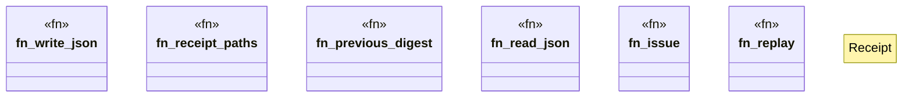

# `crates/ggen-cli/src/cmds/sbb/receipts.rs`

Source SHA-256: `29d11eb88667c7b1e929e56c67fee22705047713d3358f058b866f50bc6bc6d9`

## Dependencies

- `super::*`

## Standing

- Structural parse: `ALIVE`
- Runtime behavior: `UNKNOWN`
